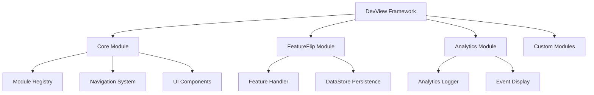

# DevView

<div align="center">

**A powerful, modular developer tools framework for Kotlin Multiplatform applications**

[](https://kotlinlang.org)
[](https://www.jetbrains.com/lp/compose-multiplatform/)
[](https://opensource.org/licenses/Apache-2.0)
[](https://github.com/worldline/devview)

</div>

---

## What's New

> **Release Highlights:**
> - _[Placeholder for latest features, improvements, and bug fixes. Update this section with each release.]_
> - Example: "Added support for iOS 14.0+, improved Analytics UI, and introduced new module registry system."

---

## What is DevView?

DevView is an extensible, in-app developer tools framework designed for Kotlin Multiplatform applications. It provides a unified interface for debugging, testing, and managing development features across Android and iOS platforms.

---

## Screenshots

> _[Placeholder: Insert screenshot of DevView overlay in an Android/iOS app. Use a device frame if possible for clarity.]_
> _[Placeholder: Insert screenshot of FeatureFlip UI showing feature toggles.]_
> _[Placeholder: Insert screenshot of Analytics UI displaying event logs.]_

---

## Getting Started

Ready to integrate DevView into your project?

<div class="grid cards" markdown>

- :material-download: **[Installation Guide](getting-started/installation.md)**

    Get DevView up and running in minutes

- :material-rocket-launch: **[Quick Start](getting-started/quick-start.md)**

    Build your first DevView integration

- :material-puzzle: **[Module Documentation](modules/index.md)**

    Explore available modules and features

- :material-code-braces: **[API Reference](api/index.html)**

    Detailed API documentation

</div>

---

## Key Features

- 🎯 **Modular Architecture** – Pick and choose the modules you need
- 🔧 **Feature Flag Management** – Toggle features on/off during development and testing
- 📊 **Analytics Debugging** – Monitor and inspect analytics events in real time
- 🎨 **Compose Multiplatform UI** – Native Material Design 3 interface
- 🔐 **Type-Safe Navigation** – Built on Navigation3 with kotlinx.serialization
- 💾 **Persistent State** – Feature states survive app restarts with DataStore
- 🚀 **Easy Integration** – Simple setup with minimal boilerplate
- 📱 **Cross-Platform** – Works seamlessly on Android and iOS

---

## Quick Example

```kotlin
@Composable
fun App() {
    var isDevViewOpen by remember { mutableStateOf(false) }
    val modules = rememberModules {
        module(FeatureFlip)
        module(Analytics)
    }
    Box {
        // Your main app content
        MainAppContent()
        // DevView overlay
        DevView(
            devViewIsOpen = isDevViewOpen,
            closeDevView = { isDevViewOpen = false },
            modules = modules
        )
        // Debug trigger
        FloatingActionButton(
            onClick = { isDevViewOpen = true }
        ) {
            Icon(Icons.Default.DeveloperMode, "Open DevView")
        }
    }
}
```

---

## Available Modules

### 🎚️ FeatureFlip

Manage feature flags with support for both local and remote features.

- Simple on/off toggles for local features
- Remote configuration with local overrides
- Persistent state management
- Search and filter capabilities

[Learn more about FeatureFlip →](modules/featureflip.md)

### 📊 Analytics

Monitor and debug analytics events in real time.

- Real-time event logging
- Multiple event types (Screen, Event, Custom)
- Tabular display with timestamps
- Event type filtering

[Learn more about Analytics →](modules/analytics.md)

### 🌐 NetworkMock

Mock and control network requests and responses for development and testing.

- Mock network requests and responses
- UI for toggling global and per-endpoint mocks
- Ktor plugin for HTTP interception
- Persistent configuration/state
- Multiplatform support (Android/iOS)

[Learn more about NetworkMock →](modules/networkmock.md)

### 🔧 Custom Modules

Extend DevView with your own custom modules.

- Simple module interface
- Type-safe navigation
- Automatic UI integration
- Section-based organisation

[Learn how to create custom modules →](modules/custom-modules.md)

---

## Why DevView?

> **Tip:** DevView is designed to save you time and make debugging, testing, and feature management a breeze. Integrate it early in your project for maximum benefit!

### For Developers

- **Faster Debugging** – Inspect feature flags and analytics without rebuilding
- **Better Testing** – Toggle features to test different configurations
- **Enhanced Visibility** – See exactly what's happening in your app
- **Time Savings** – No need to navigate deep into settings or rebuild

### For QA Teams

- **Feature Validation** – Verify features work in all states
- **Analytics Verification** – Confirm events fire correctly
- **Test Scenarios** – Easily switch between different feature configurations
- **Bug Reporting** – Include feature states in bug reports

### For Product Teams

- **Risk Mitigation** – Test features before full rollout
- **Gradual Rollouts** – Control feature availability
- **Quick Rollbacks** – Disable problematic features instantly
- **Data-Driven Decisions** – Monitor feature usage and analytics

---

## Platform Support

| Platform | Minimum Version | Status |
|----------|----------------|--------|
| Android  | API 21 (Lollipop) | ✅ Stable |
| iOS      | iOS 14.0 | ✅ Stable |

---

## Architecture

DevView follows a modular architecture where each module is:

1. **Self-Contained** – Modules manage their own state and UI
2. **Type-Safe** – Uses kotlinx.serialization for navigation
3. **Composable** – Built entirely with Compose Multiplatform
4. **Extensible** – Easy to add new modules



---

## Community & Support

- 📖 **Documentation** – You're reading it!
- 💬 **Discussions** – [GitHub Discussions](https://github.com/worldline/devview/discussions)
- 🐛 **Bug Reports** – [GitHub Issues](https://github.com/worldline/devview/issues)
- 💡 **Feature Requests** – [GitHub Issues](https://github.com/worldline/devview/issues)

---

## Licence

DevView is released under the [Apache Licence 2.0](license.md).

```
Copyright 2024-2026 Maxime Michel

Licensed under the Apache Licence, Version 2.0 (the "Licence");
you may not use this file except in compliance with the Licence.
You may obtain a copy of the Licence at

    http://www.apache.org/licenses/LICENSE-2.0
```

---

<div align="center">

**Made with ❤️ by Maxime Michel**

[Get Started](getting-started/installation.md){ .md-button .md-button--primary }
[View on GitHub](https://github.com/worldline/devview){ .md-button }

</div>
