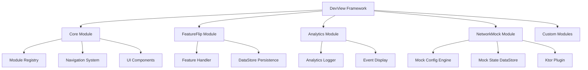

# DevView

<div align="center" markdown>


</div>

<div align="center" markdown>

**A powerful, modular developer tools framework for Kotlin Multiplatform applications**

<!-- renovate: datasource=maven depName=org.jetbrains.kotlin:kotlin-stdlib -->
[](https://kotlinlang.org)
<!-- renovate: datasource=maven depName=org.jetbrains.compose:compose-gradle-plugin -->
[](https://www.jetbrains.com/lp/compose-multiplatform/)
[](https://opensource.org/licenses/Apache-2.0)
[](https://github.com/worldline/devview)

</div>

---

## What's New

### v0.2.0-alpha03

**Added**

- NetworkMock status-family chip colors (2xx green, 4xx/5xx red, etc.) are now configurable via a `LocalMockColorScheme` CompositionLocal, mirroring `devview-consolelogger`'s `LocalLogColorScheme`. Also fixes these colors rendering as washed-out light pastels on dark surfaces — `MockColorScheme.Dark` is a proper hand-tuned dark palette rather than the light values reused verbatim. (`devview-networkmock`)
- NetworkMock UI: a multi-select HTTP method filter chip row, alongside the existing version filter. No chip selected shows every method; selecting one or more narrows the list to operations using any of the selected methods, combined with the version filter and search via AND. (`devview-networkmock`)
- `HttpMethod`: a value class modeled after Ktor's own `HttpMethod` (open set, companion constants, `DefaultMethods` for canonical ordering), replacing the raw `String` on `Operation.method` — without adding a Ktor dependency to `devview-networkmock-core`. (`devview-networkmock-core`)
- NetworkMock UI: a "Mocked"/"Network" filter chip row, and a mocked-operation count (e.g. "3 of 47 mocked") on the global mocking toggle, computed across every spec — both answer "what have I left mocked" at a glance. (`devview-networkmock`)

**Changed**

- **Breaking:** `Operation.method` is now `HttpMethod` instead of `String`. (`devview-networkmock-core`)
- **Breaking:** NetworkMock's operation detail screen is now a bottom sheet over the operation list instead of a second navigation destination — tapping an operation opens the response picker directly, without leaving the list, and picking a response dismisses the sheet. Removed: `NetworkMockDestination.Endpoint`, `NetworkMockEndpointViewModel`, `NetworkMockEndpointUiState`, and `NetworkMockScreen`'s `navigateToEndpointScreen` parameter. Added to `NetworkMockViewModel`: `sheetState: StateFlow<OperationSheetState>`, `openOperation(key)`, `closeSheet()` — response variant discovery (previously `NetworkMockEndpointViewModel`'s job) now happens here, once per sheet open. Marking a response for preview/compare is now an explicit eye-icon toggle on each row instead of a long-press, and the preview/diff view is a second page of the same sheet (reached via a "Preview"/"Compare 2 responses" button) rather than a separate bottom sheet stacked on top of the detail screen. (`devview-networkmock`)
- NetworkMock UI: the search field and version filter row moved from the top of the screen into a `Scaffold` bottom bar (alongside the new method filter), matching FeatureFlip, Analytics, and ConsoleLogger's existing layout for one-handed reach. Only the search field and an expand chevron are visible by default; the mock-state, version, and method filter rows collapse behind the chevron (matching Analytics' bottom bar). (`devview-networkmock`)
- NetworkMock UI: each operation row now shows a leading colour rail (the state chip's colour) and a colour-coded HTTP method badge; the row's separate state-summary line — which duplicated the status code already shown in the state chip — is gone (#115). The row's per-operation version badge is also gone: `Operation.version` is parsed from the very path segment shown right next to it, so the badge never showed anything the path wasn't already showing, and it crowded the state chip. The path itself no longer truncates — it wraps instead, so a long URL is never cut off. The operation sheet's picker-page header shares the same fix, since it shows the same operation identity — except the header drops the state chip entirely: the picker list right below already marks the active response with a checkmark, its full label, and a family icon/colour, so a bare-status-code chip in the header would only repeat that. (`devview-networkmock`)

---

## What is DevView?

DevView is an extensible, in-app developer tools framework designed for Kotlin Multiplatform applications. It provides a unified interface for debugging, testing, and managing development features across Android and iOS platforms.

---

## Getting Started

Ready to integrate DevView into your project?

<div class="grid cards" markdown>

- :material-download: **[Installation Guide](getting-started/installation.md)**

    Get DevView up and running in minutes

- :material-rocket-launch: **[Quick Start](getting-started/quick-start.md)**

    Build your first DevView integration

- :material-puzzle: **[Module Documentation](modules/index.md)**

    Explore available modules and features

- :material-code-braces: **[API Reference](api/index.html)**

    Detailed API documentation

</div>

---

## Key Features

- 🎯 **Modular Architecture** – Pick and choose the modules you need
- 🔧 **Feature Flag Management** – Toggle features on/off during development and testing
- 📊 **Analytics Debugging** – Monitor and inspect analytics events in real time
- 🎨 **Compose Multiplatform UI** – Native Material Design 3 interface
- 🔐 **Type-Safe Navigation** – Built on Navigation3 with kotlinx.serialization
- 💾 **Persistent State** – Feature states survive app restarts with DataStore
- 🚀 **Easy Integration** – Simple setup with minimal boilerplate
- 📱 **Cross-Platform** – Works seamlessly on Android and iOS

---

## Quick Example

```kotlin
@Composable
fun App() {
    var isDevViewOpen by remember { mutableStateOf(false) }
    val modules = rememberModules {
        module(FeatureFlip)
        module(Analytics())
    }
    Box {
        // Your main app content
        MainAppContent()
        // DevView overlay
        DevView(
            devViewIsOpen = isDevViewOpen,
            closeDevView = { isDevViewOpen = false },
            modules = modules
        )
        // Debug trigger
        FloatingActionButton(
            onClick = { isDevViewOpen = true }
        ) {
            Icon(Icons.Default.DeveloperMode, "Open DevView")
        }
    }
}
```

---

## Available Modules

### 🎚️ FeatureFlip

Manage feature flags with support for both local and remote features.

- Simple on/off toggles for local features
- Remote configuration with local overrides
- Persistent state management
- Search and filter capabilities

[Learn more about FeatureFlip →](modules/featureflip.md)

### 📊 Analytics

Monitor and debug analytics events in real time.

- Real-time event logging
- Multiple event types (Screen, Event, Custom)
- Tabular display with timestamps
- Event type filtering

[Learn more about Analytics →](modules/analytics.md)

### 🌐 NetworkMock

Mock and control network requests and responses for development and testing.

- Mock network requests and responses
- UI for toggling global and per-endpoint mocks
- Ktor plugin for HTTP interception
- Persistent configuration/state
- Multiplatform support (Android/iOS)

[Learn more about NetworkMock →](modules/networkmock.md)

### 🔧 Custom Modules

Extend DevView with your own custom modules.

- Simple module interface
- Type-safe navigation
- Automatic UI integration
- Section-based organisation

[Learn how to create custom modules →](modules/custom-modules.md)

---

## Why DevView?

> **Tip:** DevView is designed to save you time and make debugging, testing, and feature management a breeze. Integrate it early in your project for maximum benefit!

### For Developers

- **Faster Debugging** – Inspect feature flags and analytics without rebuilding
- **Better Testing** – Toggle features to test different configurations
- **Enhanced Visibility** – See exactly what's happening in your app
- **Time Savings** – No need to navigate deep into settings or rebuild

### For QA Teams

- **Feature Validation** – Verify features work in all states
- **Analytics Verification** – Confirm events fire correctly
- **Test Scenarios** – Easily switch between different feature configurations
- **Bug Reporting** – Include feature states in bug reports

### For Product Teams

- **Risk Mitigation** – Test features before full rollout
- **Gradual Rollouts** – Control feature availability
- **Quick Rollbacks** – Disable problematic features instantly
- **Data-Driven Decisions** – Monitor feature usage and analytics

---

## Platform Support

| Platform | Minimum Version | Status |
|----------|----------------|--------|
| Android  | API 26 (Oreo) | ✅ Stable |
| iOS      | iOS 16.0 | ✅ Stable |

---

## Architecture

DevView follows a modular architecture where each module is:

1. **Self-Contained** – Modules manage their own state and UI
2. **Type-Safe** – Uses kotlinx.serialization for navigation
3. **Composable** – Built entirely with Compose Multiplatform
4. **Extensible** – Easy to add new modules


```mermaid
graph TD
    A[DevView Framework] --> B[Core Module]
    A --> C[FeatureFlip Module]
    A --> D[Analytics Module]
    A --> NM[NetworkMock Module]
    A --> E[Custom Modules]
    B --> F[Module Registry]
    B --> G[Navigation System]
    B --> H[UI Components]
    C --> I[Feature Handler]
    C --> J[DataStore Persistence]
    D --> K[Analytics Logger]
    D --> L[Event Display]
    NM --> MC[Mock Config Engine]
    NM --> MS[Mock State DataStore]
    NM --> KP[Ktor Plugin]
```

---

## Community & Support

- 📖 **Documentation** – You're reading it!
- 💬 **Discussions** – [GitHub Discussions](https://github.com/worldline/devview/discussions)
- 🐛 **Bug Reports** – [GitHub Issues](https://github.com/worldline/devview/issues)
- 💡 **Feature Requests** – [GitHub Issues](https://github.com/worldline/devview/issues)

---

## Licence

DevView is released under the [Apache Licence 2.0](license.md).

```
Copyright 2024-2026 Maxime Michel

Licensed under the Apache Licence, Version 2.0 (the "Licence");
you may not use this file except in compliance with the Licence.
You may obtain a copy of the Licence at

    http://www.apache.org/licenses/LICENSE-2.0
```

---

<div align="center" markdown>

**Made with ❤️ by Maxime Michel**

[Get Started](getting-started/installation.md){ .md-button .md-button--primary }
[View on GitHub](https://github.com/worldline/devview){ .md-button }

</div>
