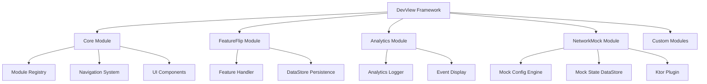

# DevView

<div align="center" markdown>


</div>

<div align="center" markdown>

**A powerful, modular developer tools framework for Kotlin Multiplatform applications**

<!-- renovate: datasource=maven depName=org.jetbrains.kotlin:kotlin-stdlib -->
[](https://kotlinlang.org)
<!-- renovate: datasource=maven depName=org.jetbrains.compose:compose-gradle-plugin -->
[](https://www.jetbrains.com/lp/compose-multiplatform/)
[](https://opensource.org/licenses/Apache-2.0)
[](https://github.com/worldline/devview)

</div>

---

## What's New

### v0.2.0-alpha01

**Added**

- `Operation.version`: a display-only version tag extracted from a `/v{n}/` path segment (e.g. `/api/v2/x` → `"v2"`), shown as a chip on each operation in the NetworkMock UI. Purely a UI label — request matching is unaffected. (`devview-networkmock-core`, `devview-networkmock`)
- NetworkMock UI: a search field (filters by name, path, or operationId) and a per-tab version filter row, both client-side over already-loaded data. (`devview-networkmock`)
- A [migration guide](guides/migrating-to-openapi.md) and a `scripts/mocks_json_to_openapi.py` conversion script for integrators upgrading from a pre-0.2.0 `mocks.json` config.
- `devview-consolelogger` module: displays the app's native console output (logcat on Android, a stdout/stderr redirect on iOS) inside the DevView overlay, with per-level filter chips, a text filter, and auto-follow. Capture works on an untethered device (no debugger required) on both platforms; an optional `DevViewLogWriter` routes Kermit-based logging into the same view, closing the one remaining gap (`NSLog`/`os_log` on iOS with no debugger attached). Log-level colors are configurable via a `LocalLogColorScheme` CompositionLocal. (`devview-consolelogger`)
- TimeCapsule rows now show a per-state change summary (e.g. `count 3 → 4`) derived from a `key=value`-shaped label, expandable to reveal the full label with changed values highlighted, plus a wall-clock timestamp alongside the existing delta pill. The screen now shows a header naming the recorded owner. (`devview-timecapsule`)

**Changed**

- **Breaking:** `devview-networkmock-core` now parses OpenAPI 3.x documents (JSON, and YAML on a best-effort basis) instead of the bespoke `mocks.json` format. One spec file is one API group — the environment axis is gone entirely; a group's request-matching hosts come from the spec's `servers[]` list, and an app talking to two hosts for the same API is simply two operations with different paths in one document. `NetworkMock(configPath: String)` is now `NetworkMock(specPaths: List<String>)`. See the [migration guide](guides/migrating-to-openapi.md). (`devview-networkmock-core`, `devview-networkmock`, `devview-networkmock-ktor`)
- Renamed to OpenAPI vocabulary throughout the networkmock modules: `ApiGroupConfig` → `ApiSpec`, `EndpointConfig` → `Operation`, `EndpointKey` → `OperationKey` (drops the `environmentId` component), `EndpointDescriptor` → `OperationDescriptor`, `EndpointMockState` → `OperationMockState`, `GroupEnvironmentUiModel` → `ApiSpecUiModel`, `EndpointUiModel` → `OperationUiModel`. `MockResponse` and `MockMatch` are deliberately **not** renamed — they model DevView's own runtime mocking behavior, not something OpenAPI describes. `EnvironmentConfig`, `EndpointOverride`, and `effectiveEndpoints` are deleted.
- Response variant discovery now reads the spec's declared `responses.<code>.content.*.examples` instead of probing status-code/suffix combinations against the filesystem. `OperationMockState.Mock` is now keyed by `(statusCode, exampleName)` instead of a response file name. (`devview-networkmock-core`)
- Response delay simulation is now declared via the `x-devview.delayMs` OpenAPI Specification Extension, at the document root (spec-wide default) and/or per operation (overrides the default) — replacing `ApiGroupConfig.defaultDelayMs` / `EndpointConfig.delayMs`. (`devview-networkmock-core`)
- DataStore entries written under the pre-0.2.0 key shape (`network_mock_endpoint_{groupId}-{environmentId}-{endpointId}`) are wiped once on first launch after upgrading — the key shape and the `Mock` payload shape both changed, so a translation wasn't attempted. The global mocking toggle is unaffected. (`devview-networkmock-core`)
- `OperationDescriptor` no longer carries `availableResponses` — the main operation list never read them, so `NetworkMockViewModel` no longer eagerly discovers and decodes every response body on app start. Response variants are now only loaded when an operation's detail screen actually opens (`NetworkMockEndpointUiState.Content.responses`). (`devview-networkmock-core`, `devview-networkmock`)
- `TimeCapsuleEffect` gains a `subtitle` parameter, inserted between `label` and `maxEntries`. Callers passing `maxEntries` positionally must switch to a named argument. (`devview-timecapsule`)

---

## What is DevView?

DevView is an extensible, in-app developer tools framework designed for Kotlin Multiplatform applications. It provides a unified interface for debugging, testing, and managing development features across Android and iOS platforms.

---

## Getting Started

Ready to integrate DevView into your project?

<div class="grid cards" markdown>

- :material-download: **[Installation Guide](getting-started/installation.md)**

    Get DevView up and running in minutes

- :material-rocket-launch: **[Quick Start](getting-started/quick-start.md)**

    Build your first DevView integration

- :material-puzzle: **[Module Documentation](modules/index.md)**

    Explore available modules and features

- :material-code-braces: **[API Reference](api/index.html)**

    Detailed API documentation

</div>

---

## Key Features

- 🎯 **Modular Architecture** – Pick and choose the modules you need
- 🔧 **Feature Flag Management** – Toggle features on/off during development and testing
- 📊 **Analytics Debugging** – Monitor and inspect analytics events in real time
- 🎨 **Compose Multiplatform UI** – Native Material Design 3 interface
- 🔐 **Type-Safe Navigation** – Built on Navigation3 with kotlinx.serialization
- 💾 **Persistent State** – Feature states survive app restarts with DataStore
- 🚀 **Easy Integration** – Simple setup with minimal boilerplate
- 📱 **Cross-Platform** – Works seamlessly on Android and iOS

---

## Quick Example

```kotlin
@Composable
fun App() {
    var isDevViewOpen by remember { mutableStateOf(false) }
    val modules = rememberModules {
        module(FeatureFlip)
        module(Analytics())
    }
    Box {
        // Your main app content
        MainAppContent()
        // DevView overlay
        DevView(
            devViewIsOpen = isDevViewOpen,
            closeDevView = { isDevViewOpen = false },
            modules = modules
        )
        // Debug trigger
        FloatingActionButton(
            onClick = { isDevViewOpen = true }
        ) {
            Icon(Icons.Default.DeveloperMode, "Open DevView")
        }
    }
}
```

---

## Available Modules

### 🎚️ FeatureFlip

Manage feature flags with support for both local and remote features.

- Simple on/off toggles for local features
- Remote configuration with local overrides
- Persistent state management
- Search and filter capabilities

[Learn more about FeatureFlip →](modules/featureflip.md)

### 📊 Analytics

Monitor and debug analytics events in real time.

- Real-time event logging
- Multiple event types (Screen, Event, Custom)
- Tabular display with timestamps
- Event type filtering

[Learn more about Analytics →](modules/analytics.md)

### 🌐 NetworkMock

Mock and control network requests and responses for development and testing.

- Mock network requests and responses
- UI for toggling global and per-endpoint mocks
- Ktor plugin for HTTP interception
- Persistent configuration/state
- Multiplatform support (Android/iOS)

[Learn more about NetworkMock →](modules/networkmock.md)

### 🔧 Custom Modules

Extend DevView with your own custom modules.

- Simple module interface
- Type-safe navigation
- Automatic UI integration
- Section-based organisation

[Learn how to create custom modules →](modules/custom-modules.md)

---

## Why DevView?

> **Tip:** DevView is designed to save you time and make debugging, testing, and feature management a breeze. Integrate it early in your project for maximum benefit!

### For Developers

- **Faster Debugging** – Inspect feature flags and analytics without rebuilding
- **Better Testing** – Toggle features to test different configurations
- **Enhanced Visibility** – See exactly what's happening in your app
- **Time Savings** – No need to navigate deep into settings or rebuild

### For QA Teams

- **Feature Validation** – Verify features work in all states
- **Analytics Verification** – Confirm events fire correctly
- **Test Scenarios** – Easily switch between different feature configurations
- **Bug Reporting** – Include feature states in bug reports

### For Product Teams

- **Risk Mitigation** – Test features before full rollout
- **Gradual Rollouts** – Control feature availability
- **Quick Rollbacks** – Disable problematic features instantly
- **Data-Driven Decisions** – Monitor feature usage and analytics

---

## Platform Support

| Platform | Minimum Version | Status |
|----------|----------------|--------|
| Android  | API 26 (Oreo) | ✅ Stable |
| iOS      | iOS 16.0 | ✅ Stable |

---

## Architecture

DevView follows a modular architecture where each module is:

1. **Self-Contained** – Modules manage their own state and UI
2. **Type-Safe** – Uses kotlinx.serialization for navigation
3. **Composable** – Built entirely with Compose Multiplatform
4. **Extensible** – Easy to add new modules


```mermaid
graph TD
    A[DevView Framework] --> B[Core Module]
    A --> C[FeatureFlip Module]
    A --> D[Analytics Module]
    A --> NM[NetworkMock Module]
    A --> E[Custom Modules]
    B --> F[Module Registry]
    B --> G[Navigation System]
    B --> H[UI Components]
    C --> I[Feature Handler]
    C --> J[DataStore Persistence]
    D --> K[Analytics Logger]
    D --> L[Event Display]
    NM --> MC[Mock Config Engine]
    NM --> MS[Mock State DataStore]
    NM --> KP[Ktor Plugin]
```

---

## Community & Support

- 📖 **Documentation** – You're reading it!
- 💬 **Discussions** – [GitHub Discussions](https://github.com/worldline/devview/discussions)
- 🐛 **Bug Reports** – [GitHub Issues](https://github.com/worldline/devview/issues)
- 💡 **Feature Requests** – [GitHub Issues](https://github.com/worldline/devview/issues)

---

## Licence

DevView is released under the [Apache Licence 2.0](license.md).

```
Copyright 2024-2026 Maxime Michel

Licensed under the Apache Licence, Version 2.0 (the "Licence");
you may not use this file except in compliance with the Licence.
You may obtain a copy of the Licence at

    http://www.apache.org/licenses/LICENSE-2.0
```

---

<div align="center" markdown>

**Made with ❤️ by Maxime Michel**

[Get Started](getting-started/installation.md){ .md-button .md-button--primary }
[View on GitHub](https://github.com/worldline/devview){ .md-button }

</div>
