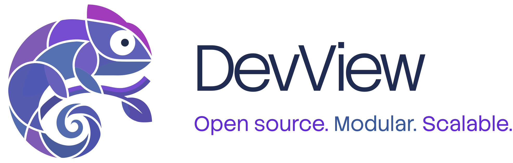
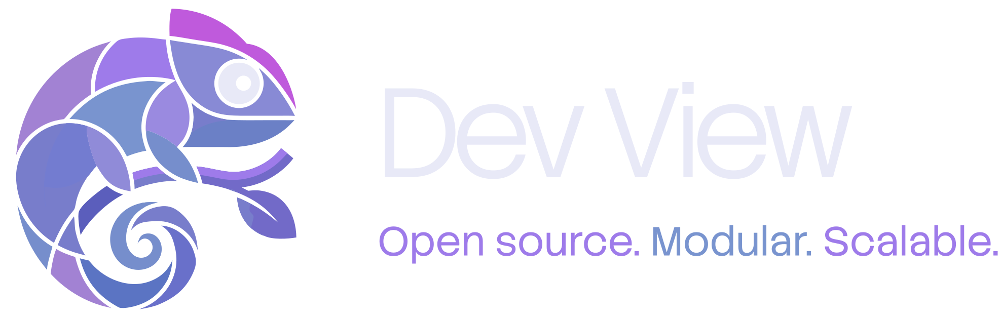
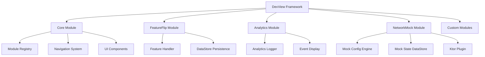

# DevView

<div align="center" markdown>




</div>

<div align="center" markdown>

**A powerful, modular developer tools framework for Kotlin Multiplatform applications**

<!-- renovate: datasource=maven depName=org.jetbrains.kotlin:kotlin-stdlib -->
[](https://kotlinlang.org)
<!-- renovate: datasource=maven depName=org.jetbrains.compose:compose-gradle-plugin -->
[](https://www.jetbrains.com/lp/compose-multiplatform/)
[](https://opensource.org/licenses/Apache-2.0)
[](https://github.com/worldline/devview)

</div>

---

## What's New

### v0.2.0-alpha04

**Added**

- NetworkMock: closed the remaining test-coverage gaps tracked in #91 — real sample specs (`sample/network`'s `sample-api.json` and `jsonplaceholder.json`) now parse through the actual `MockConfigRepository` in a new `RealSampleSpecTest` (`devview-networkmock-core`, `androidHostTest`), guarding against the shipped sample silently drifting out of sync with what the parser accepts; query-parameter matching is now exercised end-to-end through the real Ktor plugin interception path (`NetworkMockPluginTest`); the operation sheet's sticky-header status-family grouping now has explicit coverage (`NetworkMockOperationSheetTest`); and the delay-precedence chain (`Operation.delayMs ?: ApiSpec.delayMs ?: null`) now covers its previously-untested third case. Ambiguous host-match precedence, the preview/diff bottom sheet, and response Content-Type/header assertions were already covered by prior work — verified, not duplicated.
- NetworkMock: operations can now declare OpenAPI `tags`, read verbatim into a new `Operation.tags: List<String>` (empty by default, display-only — no effect on request matching, same as `Operation.version`). The operation list gains a fourth per-tab filter chip row (`tag_filter_row`, multi-select, hidden when the current spec has no tagged operations) and a sort control — a new "Sort" toolbar dropdown, wired via the shared toolbar's new `DestinationMetadataBuilder.menu` action (`NetworkMock` exposes a `sortSharedFlow`, `NetworkMockScreen` collects it). Tapping it opens a menu with one entry per sort key: spec order (default), path (A-Z), method (`HttpMethod.DefaultMethods` order), and tag (an operation's first declared tag); picking an entry sets that sort directly. Sort selection is per-tab, plain client-side state in `NetworkMockScreen`'s `ContentState`, not the ViewModel — same convention as the existing filters. See `docs/modules/networkmock-core.md`'s new "Tags" section and `docs/modules/networkmock-ui.md`. (`devview`, `devview-networkmock-core`, `devview-networkmock`, #116, #117)
- DevView: the shared top app bar's contextual actions can now be a dropdown menu of discrete choices, not just a single-tap icon or a confirm/cancel popup. `ModuleDestinationAction` gains a `menuItems: PersistentList<ModuleDestinationActionMenuItem>?` property (new public class); `DestinationMetadataBuilder` gains a `menu(icon) { item(label) { ... } }` DSL alongside the existing `action`. Precedence when both `action` and `menu` could apply: `menuItems` wins, then `popup`, then the plain `action` lambda. (`devview`, #117)
- NetworkMock: an operation can now declare narrow request-body match constraints — required top-level fields and/or a discriminator field's value, read from its `requestBody.content.<mediaType>.schema` — to disambiguate operations that would otherwise collide on path, method, and query alone (e.g. two specs sharing a host, each declaring `POST /api/payments`, differing only by body shape). Not full JSON Schema validation; an operation declaring no `requestBody`, or one with neither a required field nor a usable discriminator, matches any body, same as before. `Operation` gains `requestBodyMatch: RequestBodyMatch?` (new public class); `RequestMatcher` gains `matchesRequestBody`; `MockConfigRepository.findMatchingMock` gains an optional `requestBody: String?` parameter. `devview-networkmock-ktor`'s plugin reads the request body only when it's already a fully in-memory `OutgoingContent.ByteArrayContent` — a pure, repeatable read that never consumes or mutates anything the real network call still needs to send. See `docs/modules/networkmock-core.md`'s new "Request body matching" section. (`devview-networkmock-core`, `devview-networkmock-ktor`, #83)
- NetworkMock: a status code with a declared `content.<mediaType>.schema` but no `examples` now synthesizes a placeholder response body instead of being unmockable — primitives, `enum` (first value), `object`/`array` (recursively, by declared `type` or by the mere presence of `properties`/`items`), `allOf` (properties merged; conflicting definitions across members throw a clear error), and `oneOf` (first declared variant; `discriminator` is parsed but doesn't yet steer variant selection). Deliberately narrow, not full JSON Schema conformance — see `docs/modules/networkmock-core.md`'s new "Schema-based response synthesis" section. Schema `$ref`s resolve relative to the file containing them, like every other `$ref`. `MockResponse` gains `isSynthesized: Boolean` (default `false`); the operation picker page shows a small "Generated" badge on a synthesized response's row. (`devview-networkmock-core`, `devview-networkmock`, #82, #84)
- NetworkMock: an operation can now be configured as a **sequence** — an ordered list of responses it advances through one step per matched request, sticking on the last step once exhausted rather than looping back to the start. Useful for polling flows (order status, upload progress, async job completion) where the interesting behavior is the transition across repeated calls. Build one from the operation sheet's new "SEQUENCE" section: tap "Build a Sequence", tap responses in the desired order, then "Save Sequence"; "Reset Position" restarts at step 1 without leaving the sequence. `OperationMockState` gains a `Sequence(responses: List<Mock>, currentIndex: Int)` variant (**breaking**: another new sealed subtype); the position is persisted as part of this same state, so resetting an operation to `Network` discards it with no special-casing needed. `NetworkMockViewModel` gains `setOperationSequenceState`/`resetOperationSequencePosition`. (`devview-networkmock-core`, `devview-networkmock-ktor`, `devview-networkmock`, #96)
- NetworkMock: an operation can now simulate a network failure instead of returning a response, two ways — **deterministically**, by selecting Timeout or Connection Refused in the operation sheet's picker page (a new "Simulate Failure" section, alongside the response variants); or **probabilistically**, via a new `x-devview.failureRate` (0.0–1.0) OpenAPI extension field, which independently rolls on every otherwise-mocked request to that operation (an operation left on `Network` passthrough is never affected). Each failure kind mirrors the exception a real Ktor engine throws for the equivalent condition (`HttpRequestTimeoutException` for Timeout, a connection-level `kotlinx.io.IOException` for Connection Refused), so existing app error handling exercises the same code path. `OperationMockState` gains a `Failure(kind: FailureKind)` variant (**breaking**: exhaustive `when` blocks over `OperationMockState` need a new branch); `Operation` gains `failureRate: Double?`; `NetworkMockConfig` gains an injectable `random: Random` for deterministic tests; `MockColorScheme` gains a `failure: StatusColors` slot (**breaking**: new required constructor parameter). (`devview-networkmock-core`, `devview-networkmock-ktor`, `devview-networkmock`, #88, #95)
- NetworkMock: mocked responses now serve the `Content-Type` derived from the spec's declared media type (`responses.<code>.content.<mediaType>`, previously always hardcoded to `application/json`) plus any additional headers declared on `responses.<code>.headers` — a header's literal `example` value is served as-is, mirroring how query-parameter matching already reads a parameter's `example`. `$ref`'d headers resolve against `components.headers`. `MockResponse` gains `contentType` (default `"application/json"`) and `headers` (default empty) properties. (`devview-networkmock-core`, `devview-networkmock-ktor`, #87)
- NetworkMock: a "Reload Config" toolbar action, and `MockConfigRepository.invalidate()` / `NetworkMockViewModel.reloadConfiguration()`, to re-read and re-parse the configured OpenAPI specs without restarting the app — previously the parsed config was cached forever after the first load, with no way to pick up an edited spec file short of a process restart. Operations added, removed, or renamed in the spec appear immediately after reloading; persisted per-operation mock selections are untouched. (`devview-networkmock-core`, `devview-networkmock`, #90)

**Changed**

- **Breaking:** `MockHttpClientCall` is now `internal` instead of `public` — it was only public because Ktor's `HttpClientCall(client)` base constructor required it to be instantiable from the plugin's install code, not because integrators have a legitimate reason to construct it themselves. Its `rawContent` override already depends on the `@InternalAPI`-annotated Ktor API, so staying public compounded that instability onto this library's own tracked surface. (`devview-networkmock-ktor`, #89)

**Fixed**

- NetworkMock: `OpenApiParser`'s `$ref` resolution now disambiguates by the full `components.<section>` a fragment names, not just its trailing name — a `$ref` whose fragment points at an unexpected section (e.g. `components/parameters/Foo` where a `components/responses` entry was expected) is rejected with a clear error instead of being silently resolved against whatever section the call site happened to expect, so a same-named entry in a different section can never be conflated with the one actually referenced. `$ref` chains — an entry that itself declares another `$ref` — are now followed until a non-ref entry is reached (previously only one level deep), guarded against cycles: a circular `$ref` chain now fails with a clear error instead of hanging. Each hop of an external `$ref` chain is now resolved relative to the document that contains it (previously always the root spec's directory, so `shared/a.json` → `./b.json` loaded `b.json` next to the root spec instead of `shared/b.json`); local `#/...` refs and relative `externalValue` paths inside an external document likewise resolve against that document, not the root. (`devview-networkmock-core`)
- NetworkMock: replaced ~35 unconditional `println` calls in `MockConfigRepository` and `NetworkMockPlugin` with gated [Kermit](https://github.com/touchlab/Kermit) logging (tag `DevViewNetworkMock`), consolidating the plugin's multi-line per-request trace into one line per intercepted request. No response body content is ever logged. A host app can adjust or silence this via `Logger.setMinSeverity(...)`; `devview-consolelogger`, if installed, captures it automatically. Detekt's `ForbiddenMethodCall` rule (`println`/`print`) is now enforced repo-wide. (`devview-networkmock-core`, `devview-networkmock-ktor`, #86)
- NetworkMock: the bottom bar's search field and expand-filter button were padded as a whole `Surface`, pushing every filter chip row above them down by the system navigation bar inset as well — the inset now only pads the search field and button themselves, matching `AnalyticsScreen`'s existing (correct) layout. (`devview-networkmock`)

---

## What is DevView?

DevView is an extensible, in-app developer tools framework designed for Kotlin Multiplatform applications. It provides a unified interface for debugging, testing, and managing development features across Android and iOS platforms.

---

## Getting Started

Ready to integrate DevView into your project?

<div class="grid cards" markdown>

- :material-download: **[Installation Guide](getting-started/installation.md)**

    Get DevView up and running in minutes

- :material-rocket-launch: **[Quick Start](getting-started/quick-start.md)**

    Build your first DevView integration

- :material-puzzle: **[Module Documentation](modules/index.md)**

    Explore available modules and features

- :material-code-braces: **[API Reference](api/index.html)**

    Detailed API documentation

</div>

---

## Key Features

- 🎯 **Modular Architecture** – Pick and choose the modules you need
- 🔧 **Feature Flag Management** – Toggle features on/off during development and testing
- 📊 **Analytics Debugging** – Monitor and inspect analytics events in real time
- 🎨 **Compose Multiplatform UI** – Native Material Design 3 interface
- 🔐 **Type-Safe Navigation** – Built on Navigation3 with kotlinx.serialization
- 💾 **Persistent State** – Feature states survive app restarts with DataStore
- 🚀 **Easy Integration** – Simple setup with minimal boilerplate
- 📱 **Cross-Platform** – Works seamlessly on Android and iOS

---

## Quick Example

```kotlin
@Composable
fun App() {
    var isDevViewOpen by remember { mutableStateOf(false) }
    val modules = rememberModules {
        module(FeatureFlip)
        module(Analytics())
    }
    Box {
        // Your main app content
        MainAppContent()
        // DevView overlay
        DevView(
            devViewIsOpen = isDevViewOpen,
            closeDevView = { isDevViewOpen = false },
            modules = modules
        )
        // Debug trigger
        FloatingActionButton(
            onClick = { isDevViewOpen = true }
        ) {
            Icon(Icons.Default.DeveloperMode, "Open DevView")
        }
    }
}
```

---

## Available Modules

### 🎚️ FeatureFlip

Manage feature flags with support for both local and remote features.

- Simple on/off toggles for local features
- Remote configuration with local overrides
- Persistent state management
- Search and filter capabilities

[Learn more about FeatureFlip →](modules/featureflip.md)

### 📊 Analytics

Monitor and debug analytics events in real time.

- Real-time event logging
- Multiple event types (Screen, Event, Custom)
- Tabular display with timestamps
- Event type filtering

[Learn more about Analytics →](modules/analytics.md)

### 🌐 NetworkMock

Mock and control network requests and responses for development and testing.

- Mock network requests and responses
- UI for toggling global and per-endpoint mocks
- Ktor plugin for HTTP interception
- Persistent configuration/state
- Multiplatform support (Android/iOS)

[Learn more about NetworkMock →](modules/networkmock.md)

### 🔧 Custom Modules

Extend DevView with your own custom modules.

- Simple module interface
- Type-safe navigation
- Automatic UI integration
- Section-based organisation

[Learn how to create custom modules →](modules/custom-modules.md)

---

## Why DevView?

> **Tip:** DevView is designed to save you time and make debugging, testing, and feature management a breeze. Integrate it early in your project for maximum benefit!

### For Developers

- **Faster Debugging** – Inspect feature flags and analytics without rebuilding
- **Better Testing** – Toggle features to test different configurations
- **Enhanced Visibility** – See exactly what's happening in your app
- **Time Savings** – No need to navigate deep into settings or rebuild

### For QA Teams

- **Feature Validation** – Verify features work in all states
- **Analytics Verification** – Confirm events fire correctly
- **Test Scenarios** – Easily switch between different feature configurations
- **Bug Reporting** – Include feature states in bug reports

### For Product Teams

- **Risk Mitigation** – Test features before full rollout
- **Gradual Rollouts** – Control feature availability
- **Quick Rollbacks** – Disable problematic features instantly
- **Data-Driven Decisions** – Monitor feature usage and analytics

---

## Platform Support

| Platform | Minimum Version | Status |
|----------|----------------|--------|
| Android  | API 26 (Oreo) | ✅ Stable |
| iOS      | iOS 16.0 | ✅ Stable |

---

## Architecture

DevView follows a modular architecture where each module is:

1. **Self-Contained** – Modules manage their own state and UI
2. **Type-Safe** – Uses kotlinx.serialization for navigation
3. **Composable** – Built entirely with Compose Multiplatform
4. **Extensible** – Easy to add new modules


```mermaid
graph TD
    A[DevView Framework] --> B[Core Module]
    A --> C[FeatureFlip Module]
    A --> D[Analytics Module]
    A --> NM[NetworkMock Module]
    A --> E[Custom Modules]
    B --> F[Module Registry]
    B --> G[Navigation System]
    B --> H[UI Components]
    C --> I[Feature Handler]
    C --> J[DataStore Persistence]
    D --> K[Analytics Logger]
    D --> L[Event Display]
    NM --> MC[Mock Config Engine]
    NM --> MS[Mock State DataStore]
    NM --> KP[Ktor Plugin]
```

---

## Community & Support

- 📖 **Documentation** – You're reading it!
- 💬 **Discussions** – [GitHub Discussions](https://github.com/worldline/devview/discussions)
- 🐛 **Bug Reports** – [GitHub Issues](https://github.com/worldline/devview/issues)
- 💡 **Feature Requests** – [GitHub Issues](https://github.com/worldline/devview/issues)

---

## Licence

DevView is released under the [Apache Licence 2.0](license.md).

```
Copyright 2024-2026 Maxime Michel

Licensed under the Apache Licence, Version 2.0 (the "Licence");
you may not use this file except in compliance with the Licence.
You may obtain a copy of the Licence at

    http://www.apache.org/licenses/LICENSE-2.0
```

---

<div align="center" markdown>

**Made with ❤️ by Maxime Michel**

[Get Started](getting-started/installation.md){ .md-button .md-button--primary }
[View on GitHub](https://github.com/worldline/devview){ .md-button }

</div>
