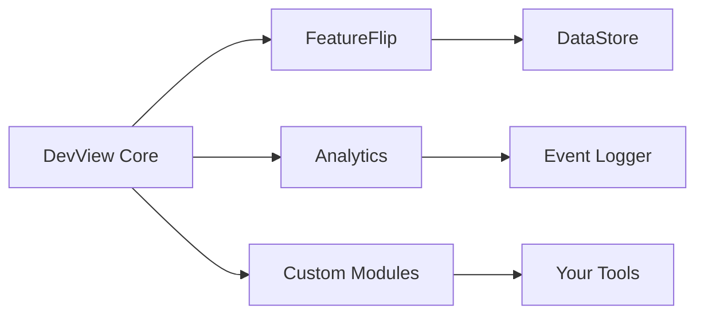

# Modules
DevView uses a modular architecture where each module provides specific developer tools functionality.
## Available Modules
### Core Module
The foundation of DevView providing the framework, navigation system, and UI infrastructure.
**Always required** - All other modules depend on the core module.
[Learn more →](core.md)
### FeatureFlip Module
Feature flag management with support for local and remote features.
**Features:**
- Local feature toggles
- Remote configuration with overrides  
- Persistent state with DataStore
- Search and filtering UI
[Learn more →](featureflip.md)
### Analytics Module
Real-time analytics event monitoring and debugging.
**Features:**
- Event logging (Screen, Event, Custom)
- Tabular display with timestamps
- Real-time updates
- Event filtering
[Learn more →](analytics.md)
## Custom Modules
Create your own modules to extend DevView with app-specific tools.
[Creating Custom Modules →](custom-modules.md)
## Module Architecture

## Integration Example
```kotlin
val modules = rememberModules {
    module(FeatureFlip)
    module(Analytics)
    module(MyCustomModule)
}
```
