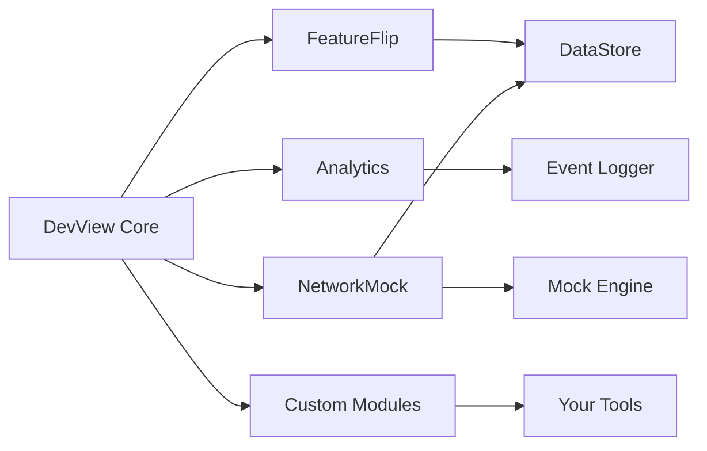

# Modules

DevView uses a modular architecture where each module provides specific developer tools functionality. Modules are plug-and-play and integrate seamlessly with the DevView core. You can include only the modules you need, and modules can be conditionally enabled based on build type, feature flags, or other criteria.

> _[Placeholder: Insert screenshot of module selection UI. Use a device frame if relevant.]_

## Available Modules

| Module         | Purpose/Features                                                                 | Link                       |
|---------------|-----------------------------------------------------------------------------------|----------------------------|
| Core           | Foundation, navigation, module system                                            | Always required            |
| FeatureFlip    | Feature flag management (local/remote), persistent state, search/filter UI       | [Learn more →](featureflip.md) |
| Analytics      | Real-time analytics event monitoring, event logging, tabular display, filtering  | [Learn more →](analytics.md)   |
| NetworkMock    | Mock network requests/responses, UI for toggling mocks, Ktor plugin integration  | [Learn more →](networkmock.md) |
| Custom Modules | Extend DevView with your own developer tools                                     | [Creating Custom Modules →](custom-modules.md) |

## When to Use Each Module
- **Core:** Required for all DevView functionality.
- **FeatureFlip:** Use for dynamic feature toggling.
- **Analytics:** Use for monitoring and debugging analytics events.
- **NetworkMock:** Use for simulating network responses, testing error handling, or developing offline features.
- **Custom Modules:** Use for bespoke developer tools tailored to your workflow.

## Module Architecture


DevView modules are plug-and-play, integrating seamlessly with the core. Modules can be conditionally enabled based on build type, feature flags, or other criteria.

## Integration Example
```kotlin
val modules = rememberModules {
    module(FeatureFlip)
    module(Analytics)
    module(NetworkMock)
    module(MyCustomModule)
}
```

_If you are new to DevView, start with the Core module and add others as your project requirements evolve. For advanced usage, see the guides and examples sections._
